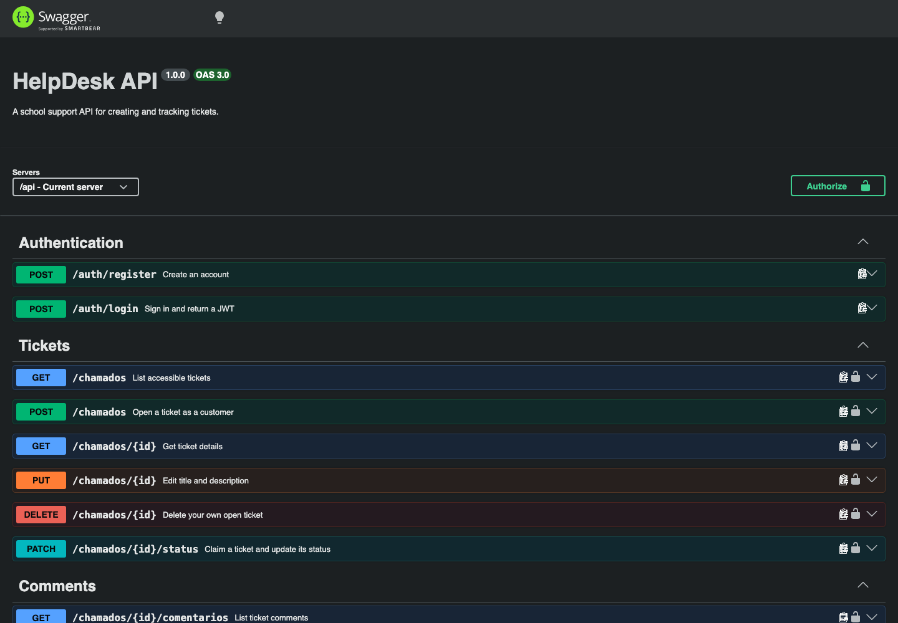

<div align="center">

# 🛠️ HelpDesk API

The service layer behind a complete support-ticket workflow.

<p>
  
  
  
  
  
</p>

A REST API for opening, tracking, discussing, and resolving customer-support tickets.

[Open the API](https://helpdesk-api-t1hv.onrender.com) · [Explore Swagger UI](https://helpdesk-api-t1hv.onrender.com/api-docs) · [View the frontend](https://github.com/Lime4idan/helpdesk-web)

</div>

---

## API preview



The live Swagger interface documents authentication, ticket management, status changes, and comments with the exact request and response formats used by the frontend.

---

## About the project

HelpDesk API powers the authentication and ticket workflow used by the HelpDesk web interface. Customers can manage their own requests, while technicians can review the support queue, claim tickets, update their status, and participate in ticket conversations.

The API separates routes, controllers, models, middleware, and documentation to keep responsibilities clear and maintenance predictable.

## Features

- Customer and technician account registration
- Login with signed JWT authentication
- Role-based access control
- Ticket creation, listing, details, editing, and deletion
- Customer ownership restrictions
- Technician queue access and assignment
- Ticket status transitions
- Ticket comments and conversation history
- Request validation and centralized error handling
- CORS restricted to the configured frontend
- Interactive Swagger documentation

## Technology

| Area | Technology |
| --- | --- |
| Runtime | Node.js |
| Framework | Express |
| Database | MySQL with `mysql2/promise` |
| Authentication | JWT and `bcryptjs` |
| Validation | `express-validator` |
| Documentation | Swagger UI and Swagger JSDoc |
| Deployment | Render |

## Architecture

```text
helpdesk-api/
├── config/         # MySQL connection
├── controllers/    # business rules and JSON responses
├── database/       # database creation script
├── docs/           # Swagger specification
├── middlewares/    # JWT authentication, validation, and errors
├── models/         # prepared statements and data access
├── routes/         # REST endpoints
├── app.js
└── render.yaml
```

## Main routes

| Method | Route | Purpose |
| --- | --- | --- |
| `POST` | `/api/auth/register` | Create an account |
| `POST` | `/api/auth/login` | Authenticate and receive a token |
| `GET` | `/api/chamados` | List accessible tickets |
| `POST` | `/api/chamados` | Open a ticket |
| `GET` | `/api/chamados/:id` | View ticket details |
| `PUT` | `/api/chamados/:id` | Edit a ticket |
| `DELETE` | `/api/chamados/:id` | Delete a ticket |
| `PATCH` | `/api/chamados/:id/status` | Claim or update ticket status |
| `GET` | `/api/chamados/:id/comentarios` | List ticket comments |
| `POST` | `/api/chamados/:id/comentarios` | Add a comment |

Private routes expect the header `Authorization: Bearer TOKEN`. Portuguese route names and status values are retained as part of the existing API contract.

## Run locally

### Requirements

- Node.js
- npm
- MySQL

### Installation

```bash
git clone https://github.com/Lime4idan/helpdesk-api.git
cd helpdesk-api
npm install
```

1. Run `database/schema.sql` in MySQL.
2. Copy `.env.example` to `.env`.
3. Fill in the required values and use a long random `JWT_SECRET`.
4. Start the development server:

```bash
npm run dev
```

The API runs at `http://localhost:3001`, and Swagger UI is available at `http://localhost:3001/api-docs`. Use `npm start` for a production-style start.

## Environment variables

| Variable | Purpose |
| --- | --- |
| `PORT` | API port |
| `DB_HOST`, `DB_PORT` | MySQL host and port |
| `DB_USER`, `DB_PASSWORD`, `DB_NAME` | Database credentials and name |
| `DB_SSL` | Enable SSL when required by the provider |
| `DB_SSL_REJECT_UNAUTHORIZED` | Control SSL server verification |
| `DB_SSL_CA_BASE64` | Base64-encoded database CA certificate |
| `JWT_SECRET` | Long secret used to sign tokens |
| `FRONTEND_URL` | Exact frontend origin allowed by CORS |
| `NODE_ENV` | Runtime environment |

> Never commit real credentials, tokens, or a production `.env` file.

## Deployment

The API uses the port provided by Render. Configure every value from `.env.example`, especially `FRONTEND_URL` with the exact Vercel origin instead of `*`.

For Aiven MySQL, enable SSL and provide the CA certificate through `DB_SSL_CA_BASE64`. `render.yaml` supports Render Blueprints without storing database credentials or the frontend origin in the repository.

## Related project

The browser interface is maintained separately in [HelpDesk Web](https://github.com/Lime4idan/helpdesk-web).

## Project status

**Status:** Live and functional  
**Focus:** REST design, authentication, role permissions, validation, and API documentation

---

<div align="center">

### 🔧 Clear requests. Organized support. Better resolutions.

</div>
